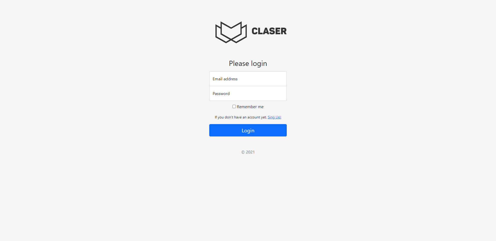
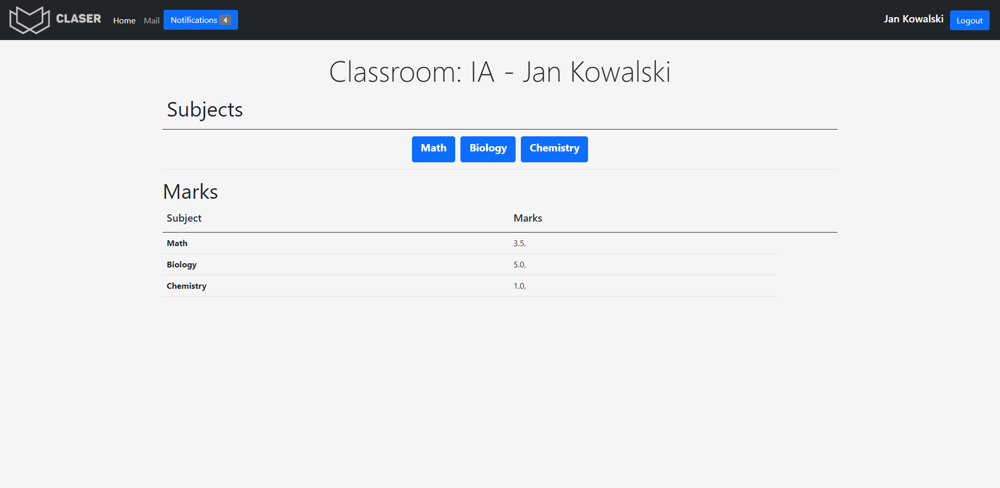
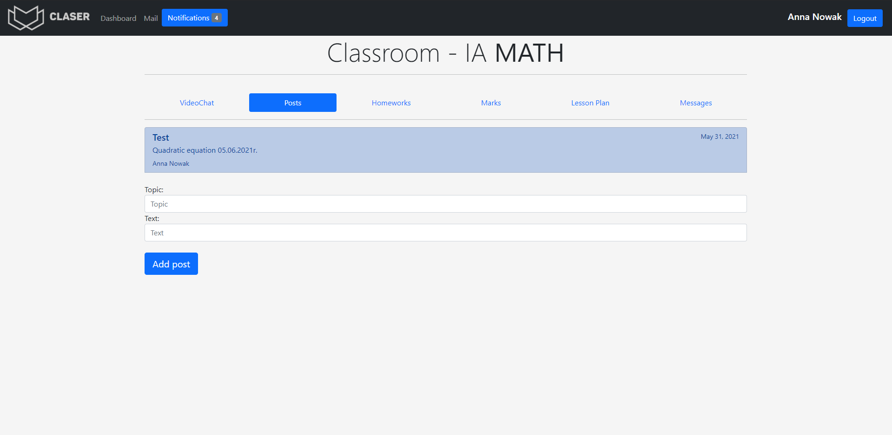
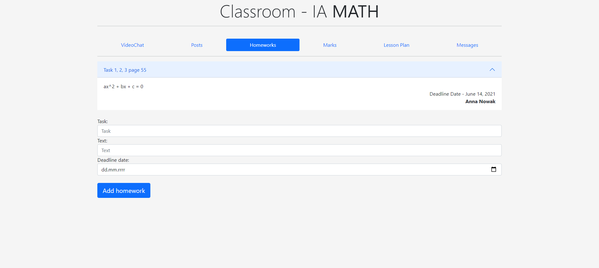
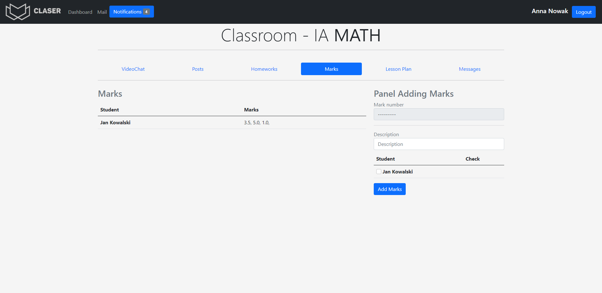

## Table of contents
* [Description](#Description)
* [Technologies](#technologies)
* [Setup](#setup)
* [Live demo](#application-demo)

# CLASER
## Description
Web application that allows the school to
manage student grades, homework and
lesson plan with video chat. The project solves 
the problem of today's distance learning. 
The aim of the project is to create a friendly and usable design.

# Technologies
* [Python 3.9.4](https://www.python.org/)
* [Django 3.3.2](https://www.djangoproject.com/)
* [PostgreSQL](https://www.postgresql.org/)
* For stylistic correctness I use [Bootstrap v5](https://getbootstrap.com/)

# Setup
## Application demo
[wronamichal-claser.herokuapp.com](https://wronamichal-claser.herokuapp.com/)

## On your PC
```bash
virtualenv env
source env/Scripts/activate
pip install requirements.txt
python manage.py runserver

```
Enter your browser on this link: [127.0.0.1:8000](http://127.0.0.1:8000/)

# Ilustrate

## Login page


## Student panel


## Teacher panel
### Posts


### Homeworks


### Marks


# Features
- Different profiles
  - Student
  - Teacher
  - Director
- Homeworks
- Marks
- Posts
- Lesson Plan
- Video chat
- Attendance list
- Messages

## To do
- Delete marks, homeworks, posts
- Lesson Plan
- Video chat
- Messages
- Director panel

# Project status
The project is in progress development, all changes and development can be seen in the project demo.
[wronamichal-claser.herokuapp.com](https://wronamichal-claser.herokuapp.com/)

# Inspiration
The current situation in the world was the inspiration for creating this application.


